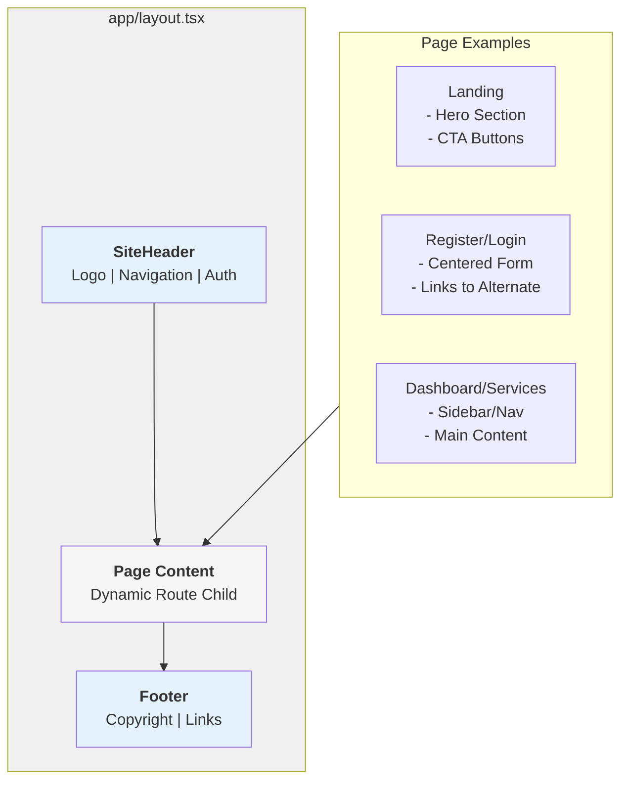

# Frontend Foundations: UI/UX & Component Guide

**Document Purpose**: Reference guide for frontend development during Days 5-6  
**Target Audience**: Frontend developers, UI/UX designers  
**Status**: 📖 Reference Documentation

---

## 📚 Table of Contents

1. [Design Principles](#design-principles)
2. [Color System](#color-system)
3. [Typography](#typography)
4. [Component Patterns](#component-patterns)
5. [Page Layouts](#page-layouts)
6. [Responsive Design](#responsive-design)
7. [State Management](#state-management)
8. [Accessibility (A11y)](#accessibility)
9. [Performance](#performance)

---

## 🎨 Design Principles

### 1. User-Centered Design

**Core Principle**: Every screen serves the citizen's or officer's goal.

- **Citizen Perspective**: "I want to register my business quickly with minimal effort"
- **Officer Perspective**: "I need to review and approve applications efficiently"

### 2. Progressive Disclosure

Show only necessary information at each step:

```
Landing → Register/Login → Dashboard → Service → Application Form
```

Each screen removes friction and builds toward the goal.

### 3. Trust & Safety

- Clear visual hierarchy
- Confirmation messages
- Error states with recovery paths
- Privacy/security indicators

### 4. Consistency

- Same buttons look and behave the same everywhere
- Navigation patterns remain constant
- Language/terminology unified

---

## 🎭 Color System

### Primary Colors

```
Primary Blue:        #0066CC (Links, CTAs, active states)
Secondary Blue:      #0052A3 (Hover states, depth)
Accent Green:        #28A745 (Success, approval)
Warning Orange:      #FFC107 (Pending, caution)
Error Red:           #DC3545 (Errors, rejection)
Neutral Gray:        #6C757D (Secondary text, disabled)
```

### Semantic Colors

| Color | Use | Hex |
|-------|-----|-----|
| Green | ✓ Success, Approved | #28A745 |
| Blue | ℹ Info, Links | #0066CC |
| Orange | ⚠ Warning, Pending | #FFC107 |
| Red | ✗ Error, Rejected | #DC3545 |
| Gray | Disabled, Secondary | #6C757D |

### Background Colors

```
Surface (Main):      #FFFFFF (Primary surfaces)
Surface (Secondary): #F8F9FA (Cards, sections)
Surface (Tertiary):  #E9ECEF (Disabled, subtle backgrounds)
```

### Tailwind CSS Configuration

```javascript
// tailwind.config.ts
module.exports = {
  theme: {
    colors: {
      primary: {
        50: "#E6F2FF",
        100: "#CCE5FF",
        500: "#0066CC",
        600: "#0052A3",
        700: "#003D7A",
      },
      success: "#28A745",
      warning: "#FFC107",
      error: "#DC3545",
      gray: {
        50: "#F9FAFB",
        100: "#F3F4F6",
        600: "#4B5563",
        900: "#111827",
      },
    },
  },
};
```

---

## 📝 Typography

### Font Stack

```css
/* Use system fonts for performance */
font-family: -apple-system, BlinkMacSystemFont, "Segoe UI", Roboto, "Helvetica Neue", Arial, sans-serif;
```

### Type Scale

| Role | Size | Weight | Line Height | Use |
|------|------|--------|-------------|-----|
| H1 | 32px | 700 | 1.2 | Page titles |
| H2 | 24px | 700 | 1.3 | Section headings |
| H3 | 20px | 600 | 1.4 | Subsections |
| Body | 16px | 400 | 1.5 | Paragraphs, labels |
| Small | 14px | 400 | 1.5 | Helper text, captions |
| Tiny | 12px | 400 | 1.4 | Metadata, timestamps |

### Tailwind Typography Classes

```html
<!-- Heading 1 -->
<h1 class="text-3xl font-bold leading-tight">Page Title</h1>

<!-- Heading 2 -->
<h2 class="text-2xl font-bold leading-snug">Section Heading</h2>

<!-- Body Text -->
<p class="text-base font-normal leading-relaxed">Paragraph text</p>

<!-- Small Text -->
<p class="text-sm font-normal text-gray-600">Helper text or caption</p>
```

---

## 🧩 Component Patterns

### Button Component

**Variants**: Primary, Secondary, Danger, Disabled

```tsx
// components/Button.tsx
interface ButtonProps {
  variant?: "primary" | "secondary" | "danger";
  disabled?: boolean;
  onClick?: () => void;
  children: React.ReactNode;
}

export function Button({
  variant = "primary",
  disabled = false,
  onClick,
  children,
}: ButtonProps) {
  const styles = {
    primary: "bg-blue-600 text-white hover:bg-blue-700 disabled:bg-gray-400",
    secondary: "bg-gray-200 text-gray-900 hover:bg-gray-300 disabled:bg-gray-100",
    danger: "bg-red-600 text-white hover:bg-red-700 disabled:bg-gray-400",
  };

  return (
    <button
      className={`px-4 py-2 rounded-lg font-semibold transition-colors ${styles[variant]}`}
      disabled={disabled}
      onClick={onClick}
    >
      {children}
    </button>
  );
}
```

### Form Input Component

```tsx
// components/FormInput.tsx
interface FormInputProps {
  label: string;
  type?: string;
  placeholder?: string;
  value: string;
  onChange: (value: string) => void;
  error?: string;
  required?: boolean;
}

export function FormInput({
  label,
  type = "text",
  placeholder,
  value,
  onChange,
  error,
  required = false,
}: FormInputProps) {
  return (
    <div className="mb-4">
      <label className="block text-sm font-medium text-gray-700 mb-2">
        {label} {required && <span className="text-red-600">*</span>}
      </label>
      <input
        type={type}
        placeholder={placeholder}
        value={value}
        onChange={(e) => onChange(e.target.value)}
        className={`w-full px-3 py-2 border rounded-lg focus:outline-none focus:ring-2 ${
          error
            ? "border-red-500 focus:ring-red-200"
            : "border-gray-300 focus:ring-blue-200"
        }`}
      />
      {error && <p className="text-red-600 text-sm mt-1">{error}</p>}
    </div>
  );
}
```

### Card Component

```tsx
// components/Card.tsx
interface CardProps {
  title?: string;
  children: React.ReactNode;
  className?: string;
}

export function Card({ title, children, className = "" }: CardProps) {
  return (
    <div className={`bg-white rounded-lg shadow-md p-6 ${className}`}>
      {title && <h2 className="text-xl font-bold mb-4">{title}</h2>}
      {children}
    </div>
  );
}
```

### Alert Component

```tsx
// components/Alert.tsx
type AlertType = "success" | "error" | "warning" | "info";

interface AlertProps {
  type: AlertType;
  message: string;
  onClose?: () => void;
}

export function Alert({ type, message, onClose }: AlertProps) {
  const colors = {
    success: "bg-green-50 text-green-800 border-green-300",
    error: "bg-red-50 text-red-800 border-red-300",
    warning: "bg-yellow-50 text-yellow-800 border-yellow-300",
    info: "bg-blue-50 text-blue-800 border-blue-300",
  };

  return (
    <div className={`border rounded-lg p-4 mb-4 ${colors[type]}`}>
      <div className="flex justify-between items-start">
        <p>{message}</p>
        {onClose && (
          <button
            onClick={onClose}
            className="text-lg font-bold"
            aria-label="Close alert"
          >
            ×
          </button>
        )}
      </div>
    </div>
  );
}
```

---

## 📄 Page Layouts

### Layout System (Mermaid)



### Landing Page Layout

```
┌─────────────────────────────────────────────┐
│  Header (Navigation)                        │
├─────────────────────────────────────────────┤
│                                             │
│  ┌─────────────────────────────────────┐   │
│  │  Hero Section                       │   │
│  │  - Headline                         │   │
│  │  - Subheadline                      │   │
│  │  - CTA: Register / Sign In          │   │
│  └─────────────────────────────────────┘   │
│                                             │
│  ┌─────────────────────────────────────┐   │
│  │  Features Section                   │   │
│  │  - Feature 1 | Feature 2            │   │
│  │  - Feature 3 | Feature 4            │   │
│  └─────────────────────────────────────┘   │
│                                             │
│  ┌─────────────────────────────────────┐   │
│  │  How It Works Section               │   │
│  │  Step 1 → Step 2 → Step 3           │   │
│  └─────────────────────────────────────┘   │
│                                             │
├─────────────────────────────────────────────┤
│  Footer                                     │
└─────────────────────────────────────────────┘
```

### Protected Page Layout (Dashboard/Services)

```
┌──────────────────────────────────────────────┐
│  Header (Logo + Links + User Menu)           │
├────────────────┬─────────────────────────────┤
│                │                             │
│  Sidebar       │  Main Content               │
│  - Dashboard   │  ┌───────────────────────┐  │
│  - Services    │  │  Page Title           │  │
│  - Profile     │  ├───────────────────────┤  │
│  - Logout      │  │                       │  │
│                │  │  Dynamic Content      │  │
│                │  │  (Cards, Tables, etc) │  │
│                │  │                       │  │
│                │  └───────────────────────┘  │
├────────────────┴─────────────────────────────┤
│  Footer                                      │
└──────────────────────────────────────────────┘
```

---

## 📱 Responsive Design

### Breakpoints (Tailwind)

| Breakpoint | Width | Use |
|-----------|-------|-----|
| `sm` | 640px | Tablets (portrait) |
| `md` | 768px | Tablets (landscape) |
| `lg` | 1024px | Small desktops |
| `xl` | 1280px | Large desktops |

### Responsive Example

```tsx
// Hero section that adapts to screen size
export function HeroSection() {
  return (
    <section className="px-4 sm:px-6 md:px-8 py-8 md:py-16">
      <h1 className="text-2xl sm:text-3xl md:text-4xl font-bold leading-tight">
        Register Your Business
      </h1>
      <p className="text-base sm:text-lg md:text-xl text-gray-600 mt-4">
        Simple. Fast. Secure.
      </p>
      <div className="mt-8 flex flex-col sm:flex-row gap-4">
        <Button variant="primary">Get Started</Button>
        <Button variant="secondary">Learn More</Button>
      </div>
    </section>
  );
}
```

### Grid Layout

```tsx
// Responsive card grid
export function ServiceGrid() {
  return (
    <div className="grid grid-cols-1 md:grid-cols-2 lg:grid-cols-3 gap-6">
      {services.map((service) => (
        <Card key={service.id} title={service.name}>
          <p>{service.description}</p>
          <Button className="mt-4">Apply Now</Button>
        </Card>
      ))}
    </div>
  );
}
```

---

## 🧠 State Management

### Context API Pattern (Recommended)

```tsx
// lib/authContext.tsx
import { createContext, useContext, ReactNode } from "react";

interface User {
  id: string;
  email: string;
  role: "citizen" | "officer" | "admin";
}

interface AuthContextType {
  user: User | null;
  isLoading: boolean;
  login: (email: string, password: string) => Promise<void>;
  logout: () => void;
}

const AuthContext = createContext<AuthContextType | undefined>(undefined);

export function AuthProvider({ children }: { children: ReactNode }) {
  // Implementation here
  return (
    <AuthContext.Provider value={value}>
      {children}
    </AuthContext.Provider>
  );
}

export function useAuth() {
  const context = useContext(AuthContext);
  if (!context) throw new Error("useAuth must be used within AuthProvider");
  return context;
}
```

### Usage in Components

```tsx
// pages/dashboard.tsx
export default function Dashboard() {
  const { user } = useAuth();

  if (!user) return <div>Loading...</div>;

  return (
    <div>
      <h1>Welcome, {user.email}</h1>
      {/* Page content */}
    </div>
  );
}
```

---

## ♿ Accessibility (A11y)

### WCAG 2.1 Compliance

1. **Keyboard Navigation**: All interactive elements accessible via Tab
2. **Screen Reader Support**: Semantic HTML + ARIA labels
3. **Color Contrast**: 4.5:1 ratio for text (WCAG AA)
4. **Focus Indicators**: Clear visual focus state on buttons/inputs

### Checklist

```html
<!-- ✓ Use semantic HTML -->
<button>Submit</button>  <!-- Not <div onClick> -->

<!-- ✓ Aria labels for icons -->
<button aria-label="Close menu">×</button>

<!-- ✓ Form associations -->
<label htmlFor="email">Email:</label>
<input id="email" type="email" />

<!-- ✓ Skip links -->
<a href="#main-content" className="sr-only">Skip to content</a>

<!-- ✓ Focus visible -->
<button className="focus:ring-2 focus:ring-blue-500">Click Me</button>
```

---

## ⚡ Performance

### Image Optimization

```tsx
// Use Next.js Image component
import Image from "next/image";

export function Logo() {
  return (
    <Image
      src="/logo.png"
      alt="BizReg Logo"
      width={200}
      height={50}
      priority  // Load immediately
    />
  );
}
```

### Code Splitting

```tsx
// Lazy load heavy components
import dynamic from "next/dynamic";

const HeavyComponent = dynamic(() => import("./HeavyComponent"), {
  loading: () => <div>Loading...</div>,
});
```

### CSS Optimization

- Use Tailwind CSS (purges unused styles in production)
- Keep animations smooth (60fps)
- Minimize re-renders with React.memo where appropriate

---

## 📐 Component Checklist (Ready for Day 5)

### Core Components to Build

- [ ] **Header** (`SiteHeader.tsx`)
  - Logo
  - Navigation links
  - User dropdown (authenticated)
  - Mobile menu toggle

- [ ] **Navigation** (Sidebar or Top Nav)
  - Dashboard link
  - Services link
  - Profile link
  - Logout button

- [ ] **Forms**
  - Text inputs (email, password, name)
  - Select/dropdown
  - Checkbox
  - Radio buttons
  - Form validation feedback

- [ ] **Layout Components**
  - Page wrapper with max-width
  - Card container
  - Section divider
  - Breadcrumbs (for multi-step forms)

- [ ] **Feedback Components**
  - Alert/notification
  - Loading spinner
  - Empty state
  - Error message

- [ ] **Pages**
  - Landing page (`app/page.tsx`)
  - Register page (`app/register/page.tsx`)
  - Login page (`app/login/page.tsx`)
  - Dashboard page (`app/dashboard/page.tsx`)
  - Services page (`app/services/page.tsx`)
  - Service detail (business registration form)

---

## 🎬 Implementation Timeline

### Day 5: Frontend Authentication Pages

1. **Morning (4 hours)**
   - Enhance auth utilities (JWT storage, refresh)
   - Build Register page
   - Build Login page

2. **Afternoon (4.5 hours)**
   - Build Dashboard page
   - Build ProtectedRoute component
   - Add logout functionality
   - Test auth flow end-to-end

### Day 6: Business Registration Form

1. **Morning (3 hours)**
   - Design multi-step form flow
   - Build 4-step form wizard component
   - Implement step validation

2. **Afternoon (2 hours)**
   - Build form submission
   - Implement success confirmation
   - Add styling and responsiveness

3. **Evening (2 hours)**
   - Test on mobile
   - Fix responsive issues
   - Deploy to staging

---

## 📚 Design Resources

- **Figma Design Kit**: (shared with team)
- **Storybook**: (optional component library documentation)
- **Accessibility Checker**: https://www.axe-core.org/
- **Lighthouse**: Chrome DevTools built-in audit

---

## 🔗 Integration with Backend

### API Endpoints Used in Frontend

```
Auth:
  POST   /api/v1/auth/register           (Register)
  POST   /api/v1/auth/token              (Login)
  GET    /api/v1/auth/me                 (Get current user)

Services:
  GET    /api/v1/services                (List services)

Applications:
  POST   /api/v1/applications            (Create application)
  GET    /api/v1/applications/me         (Get user's applications)
  GET    /api/v1/applications/{id}       (Get application detail)
```

### Token Storage & Usage

```tsx
// lib/auth.ts
export function setTokens(accessToken: string, refreshToken: string) {
  localStorage.setItem("access_token", accessToken);
  localStorage.setItem("refresh_token", refreshToken);
}

export function getTokens() {
  return {
    access: localStorage.getItem("access_token"),
    refresh: localStorage.getItem("refresh_token"),
  };
}

export async function fetchWithAuth(url: string, options: RequestInit = {}) {
  const { access } = getTokens();
  return fetch(url, {
    ...options,
    headers: {
      ...options.headers,
      Authorization: `Bearer ${access}`,
    },
  });
}
```

---

## 🚀 Success Criteria

By Day 6 completion, you should have:

✅ Landing page with hero section and CTAs  
✅ Registration page with validation  
✅ Login page with OAuth2 flow  
✅ Protected dashboard with application list  
✅ Service catalogue view  
✅ 4-step business registration form  
✅ Responsive design (mobile, tablet, desktop)  
✅ Accessible components (WCAG AA)  
✅ Proper error handling and loading states  
✅ All pages linked and navigable  

---

## 📝 Notes

- All styling uses Tailwind CSS (no CSS files)
- Next.js App Router for all routing (no Pages Router)
- TypeScript for type safety
- localStorage for token storage (upgrade to HttpOnly cookies in production)
- No external UI libraries (build from scratch with Tailwind)

---

**Next**: See [DAY-2-DATABASE-MODELING.md](DAY-2-DATABASE-MODELING.md) for backend work.  
**Reference**: See [ARCHITECTURE-DIAGRAMS.md](docs/ARCHITECTURE-DIAGRAMS.md) for system overview.

