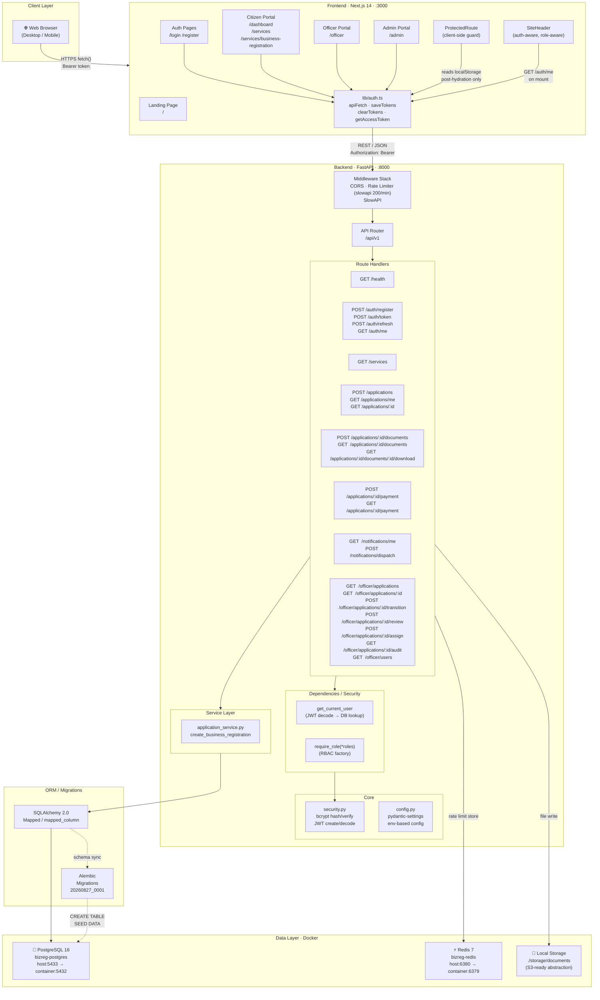
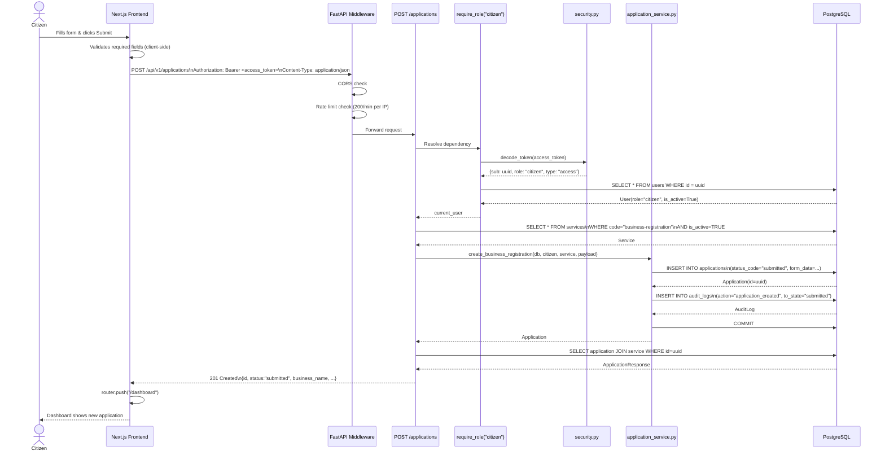
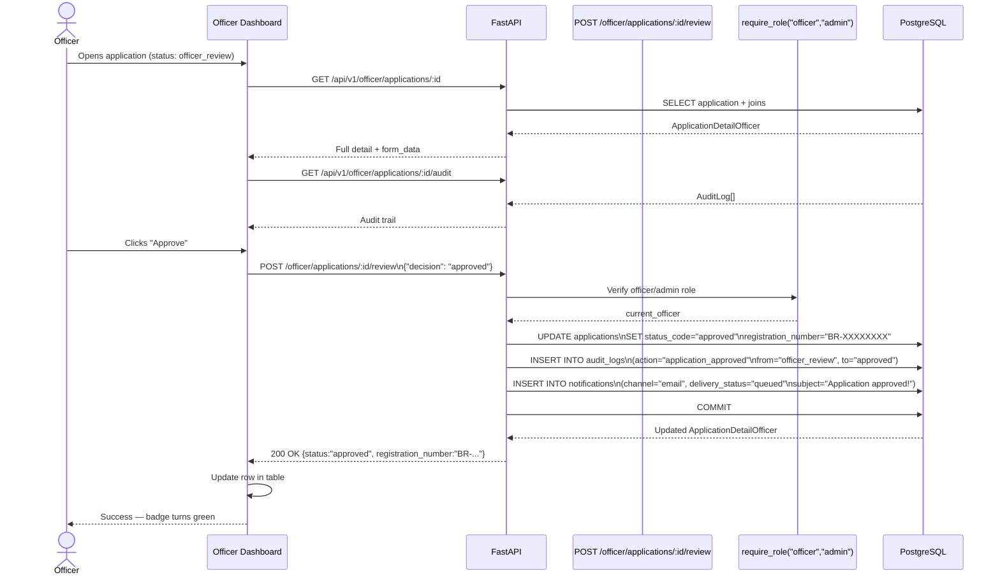
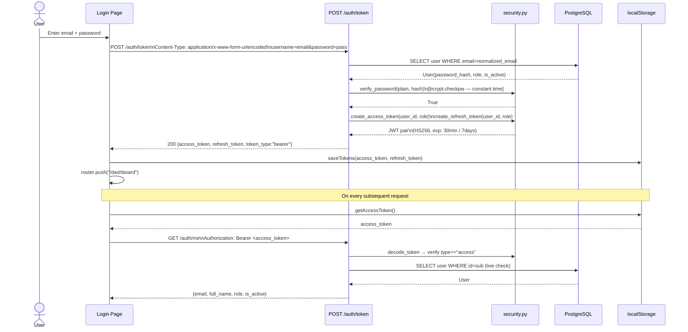
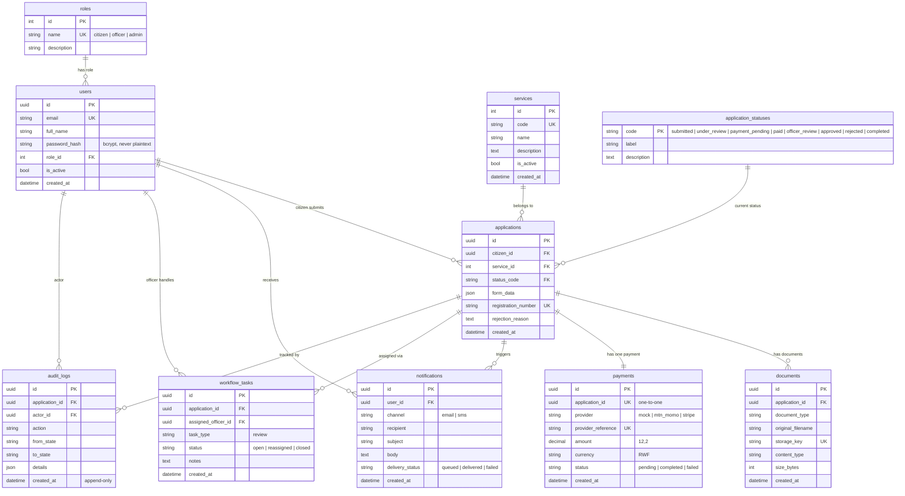
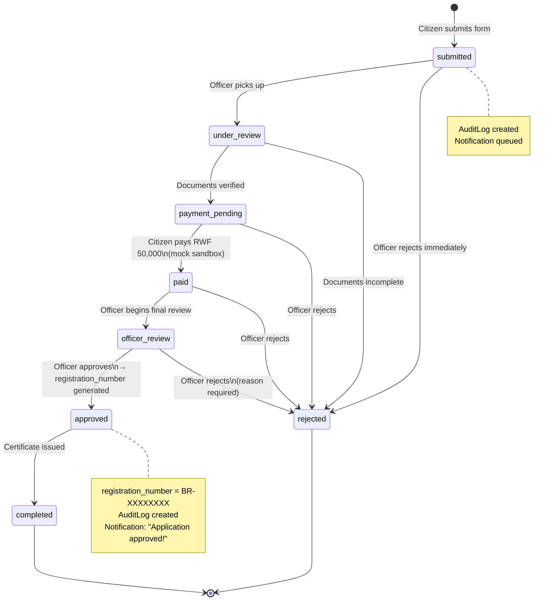
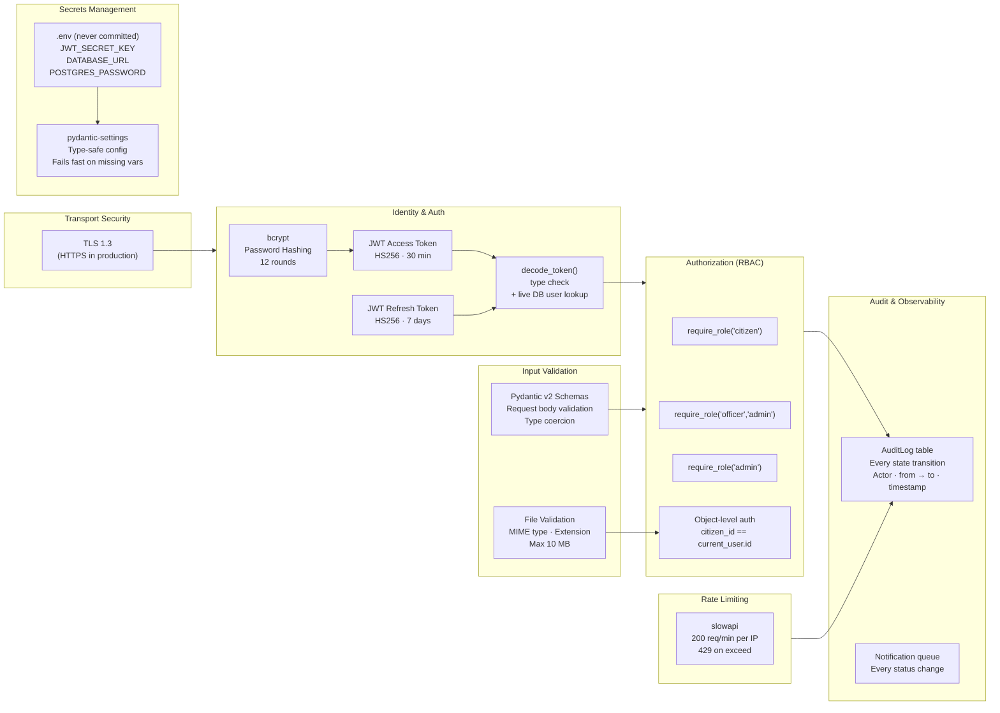
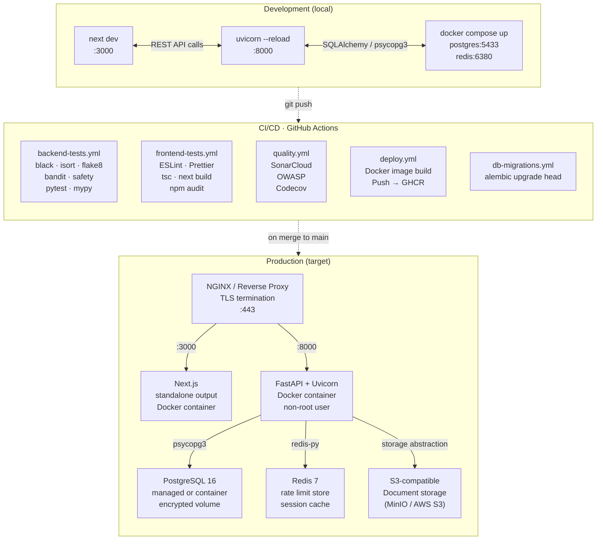
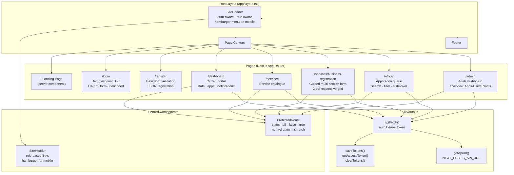

# BizReg — System Architecture & Data Flow

> Digital Public Service Platform · SecureAI Labs  
> Built following the 14-Day Full-Stack Development Curriculum

---

## 1. High-Level System Architecture

---

## 2. Request / Response Data Flow

### 2a. Citizen submits a business registration application

### 2b. Officer reviews and approves an application

### 2c. Authentication flow (Login → JWT → Protected request)

---

## 3. Database Schema & Relationships

---

## 4. Workflow State Machine

---

## 5. Security Architecture

---

## 6. Deployment Architecture

---

## 7. Frontend Component Architecture

---

## Summary Table

| Layer | Technology | Version | Role |
|---|---|---|---|
| Frontend | Next.js (App Router) | 14.2 | UI, routing, SSR |
| Frontend lang | TypeScript | 5.8 | Type safety |
| Styling | Tailwind CSS | 3.4 | Responsive design |
| Backend | FastAPI | 0.115 | REST API, validation |
| Backend lang | Python | 3.13 | Business logic |
| Server | Uvicorn | 0.34 | ASGI server |
| ORM | SQLAlchemy | 2.0 | DB abstraction |
| Migrations | Alembic | 1.15 | Schema versioning |
| DB driver | psycopg (v3) | 3.2 | PostgreSQL adapter |
| Database | PostgreSQL | 16 | Primary data store |
| Cache / Rate | Redis | 7 | Rate limit store |
| Auth | PyJWT + bcrypt | 2.10 / 4.2 | JWT + password hashing |
| Validation | Pydantic v2 | 2.x | Schema validation |
| Rate limiting | slowapi | 0.1.9 | 200 req/min per IP |
| Containerisation | Docker + Compose | — | Local infra |
| CI/CD | GitHub Actions | — | 5 workflows |
| Registry | GHCR | — | Docker image push |
