# BizReg Architecture Diagrams

This file contains visual Mermaid diagrams for the BizReg system architecture, data flows, and workflows.

## 1. System Architecture Overview

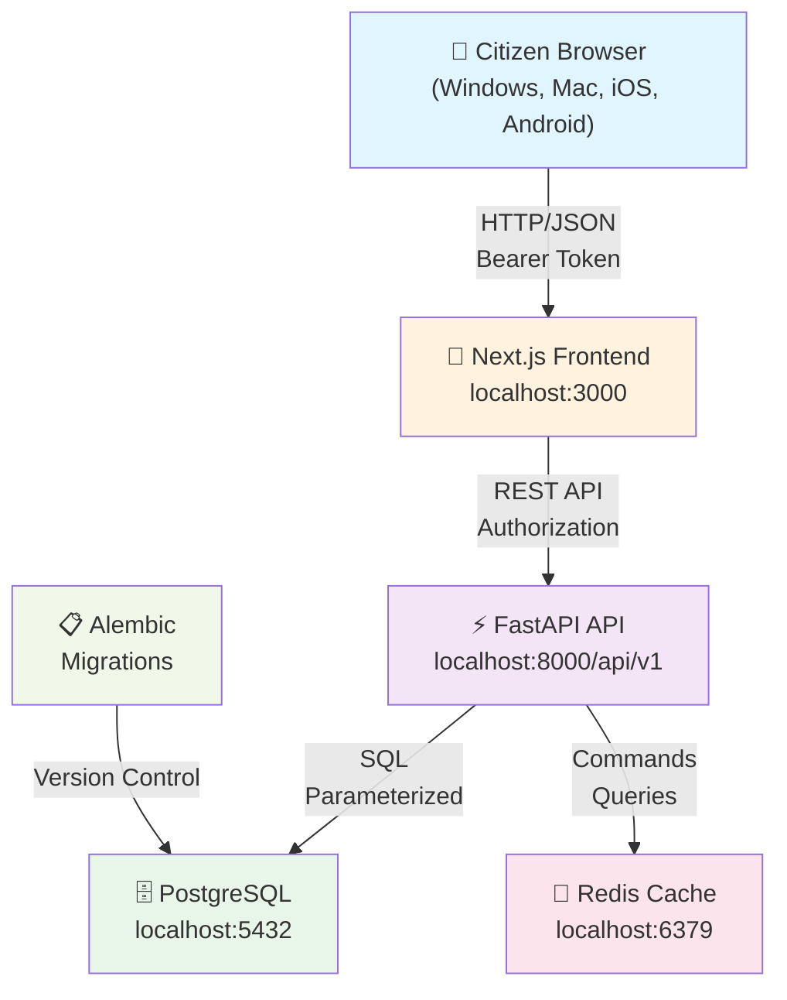

## 2. Frontend Pages & Routing

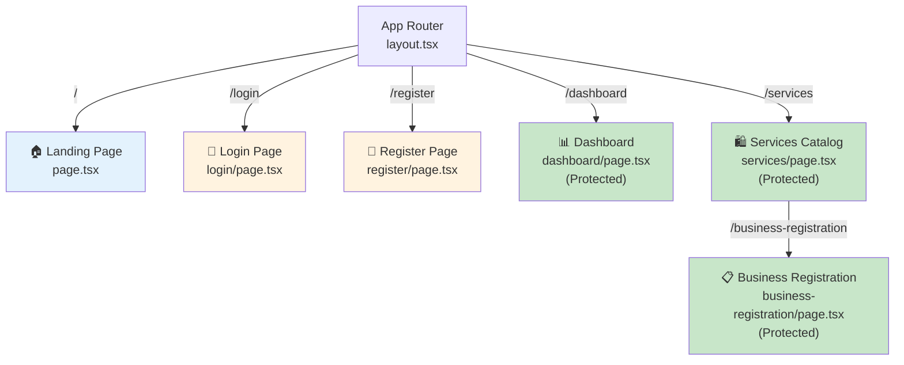

## 3. API Route Structure

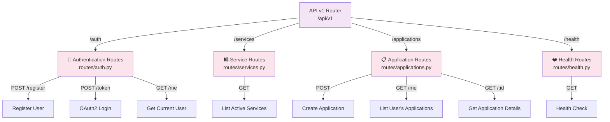

## 4. Request Lifecycle: Application Submission

```mermaid
sequenceDiagram
    participant Browser as 🌐 Browser
    participant Frontend as 📄 Next.js
    participant API as ⚡ FastAPI
    participant Schema as ✔️ Validation
    participant Service as 🔧 Business Logic
    participant DB as 🗄️ PostgreSQL
    
    Browser->>Frontend: User clicks "Submit"
    Frontend->>API: POST /api/v1/applications<br/>{business_name, type, address}<br/>Authorization: Bearer token
    
    API->>API: Extract JWT from header
    API->>DB: Verify JWT signature & expiry
    DB-->>API: ✓ Token valid
    
    API->>DB: Query User & Role by token.sub
    DB-->>API: User {id, email, role_id}
    
    API->>Schema: Validate CreateApplicationRequest
    Schema-->>API: ✓ Valid or ✗ Error (422)
    
    API->>Service: create_business_registration(user, form_data)
    
    Service->>DB: BEGIN TRANSACTION
    Service->>DB: Query Service "business-registration"
    DB-->>Service: Service object
    
    Service->>DB: Query Status "submitted"
    DB-->>Service: Status object
    
    Service->>DB: INSERT Application
    DB-->>Service: Application {id, created_at}
    
    Service->>DB: INSERT AuditLog
    DB-->>Service: AuditLog {id, created_at}
    
    Service->>DB: COMMIT TRANSACTION
    DB-->>Service: ✓ Success
    
    Service-->>API: Application object
    API-->>Frontend: HTTP 201 Created<br/>{application_id, status, form_data}
    
    Frontend->>Browser: Show success message
    Browser->>Frontend: Redirect to /dashboard
    Frontend->>API: GET /api/v1/applications/me
    API->>DB: Query User's applications
    DB-->>API: [Application list]
    API-->>Frontend: List of applications
    Frontend->>Browser: Render dashboard with new app
    
    style Browser fill:#e1f5ff
    style Frontend fill:#fff3e0
    style API fill:#f3e5f5
    style Schema fill:#fff9c4
    style Service fill:#f3e5f5
    style DB fill:#e8f5e9
```

## 5. Authentication Flow: Registration & Login

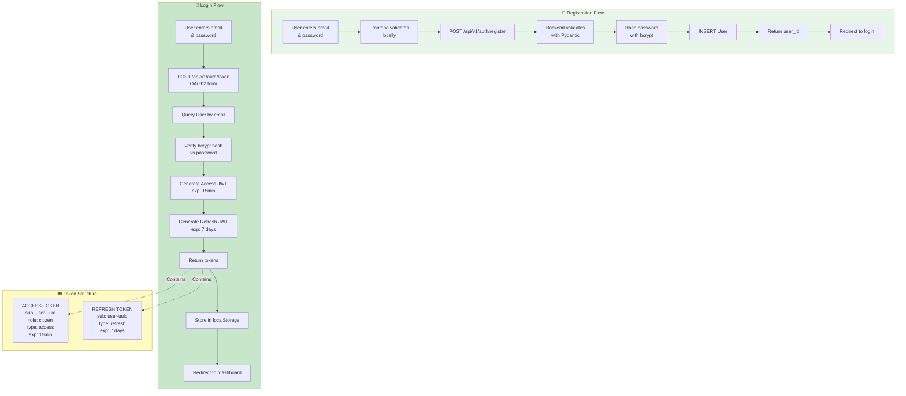

## 6. Database Entity Relationship Diagram

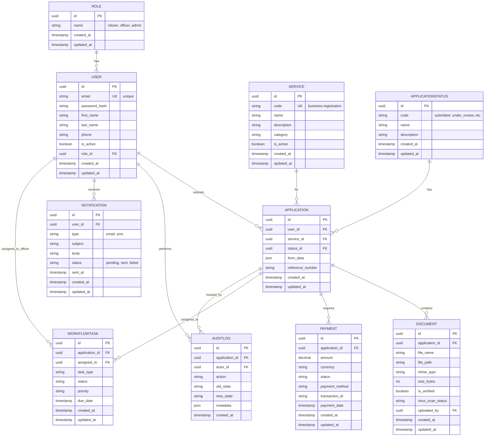

## 7. Application State Machine

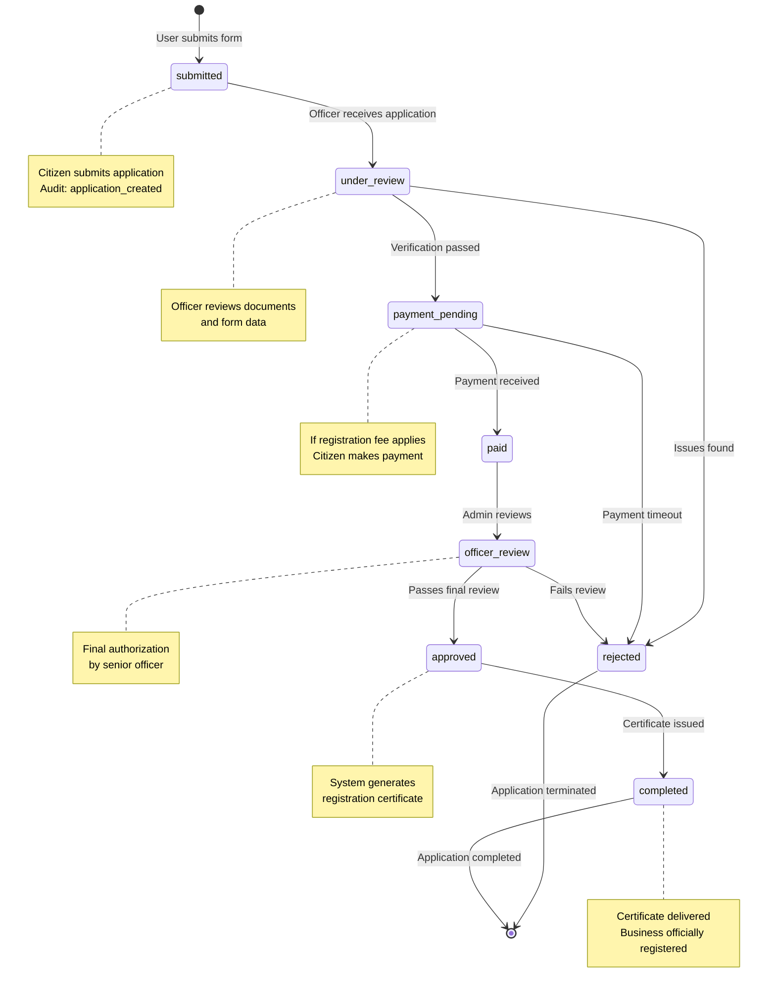

## 8. API Dependency Injection Chain

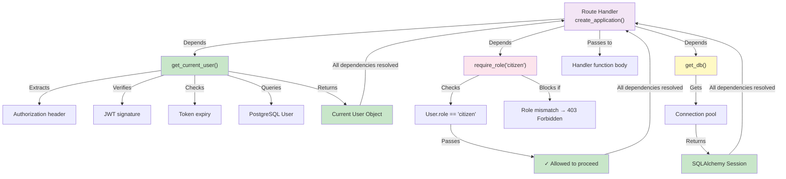

## 9. API Response Error Flow

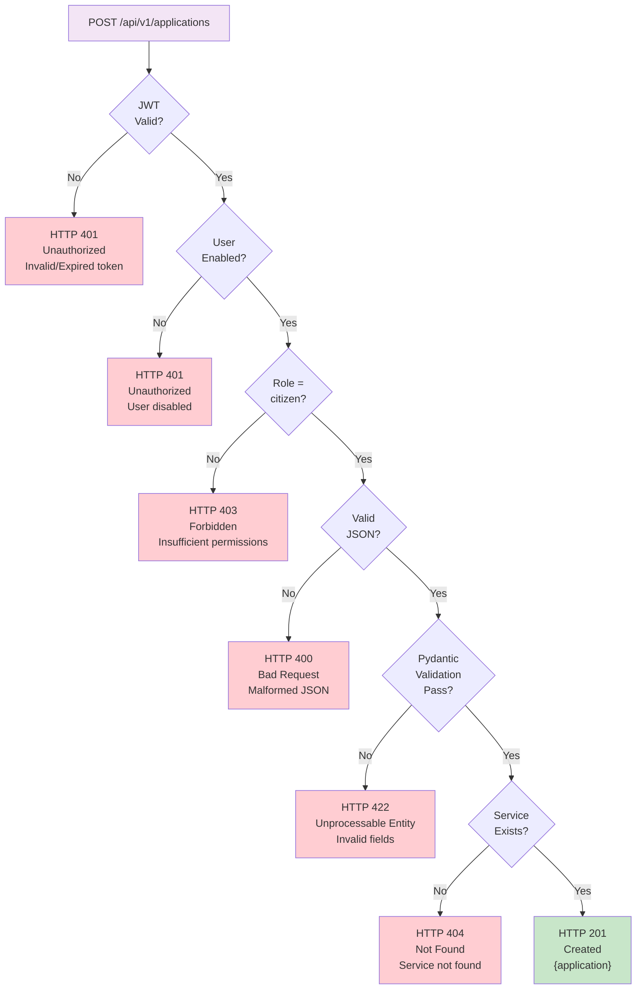

## 10. Frontend Authentication State Flow

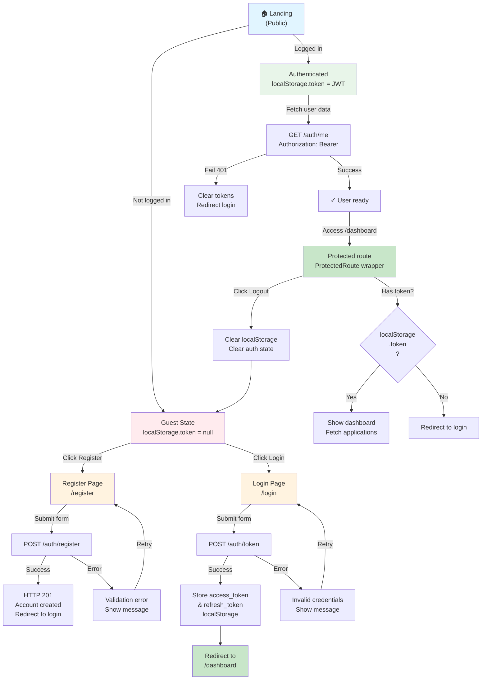

## 11. Deployment Architecture (Future - Phase 11)

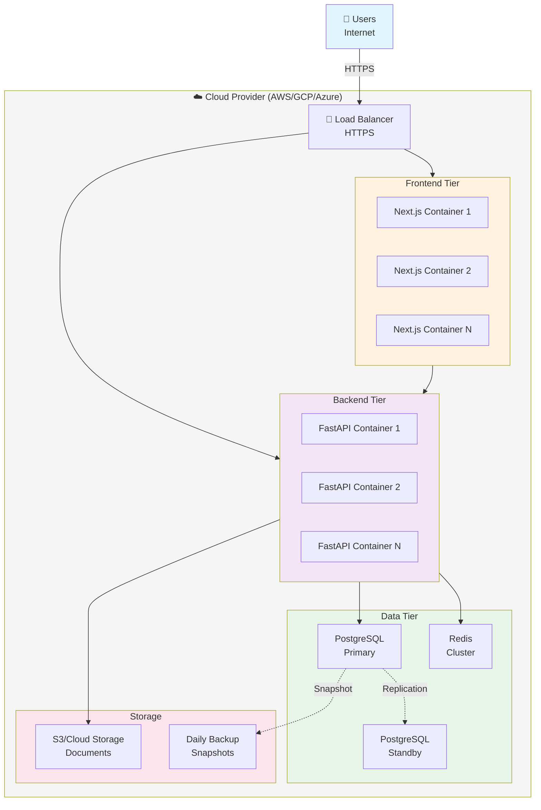

## 12. Security Layers

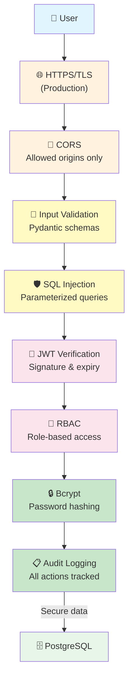

---

## How to Use These Diagrams

1. **System Architecture (Diagram 1)**: Use for high-level overview with stakeholders
2. **Frontend Routing (Diagram 2)**: Reference for understanding page flow
3. **API Routes (Diagram 3)**: Share with API consumers
4. **Request Lifecycle (Diagram 4)**: Deep-dive for developers understanding the flow
5. **Authentication (Diagram 5)**: Reference for security reviews
6. **Database Schema (Diagram 6)**: Use for database design discussions
7. **State Machine (Diagram 7)**: Reference for workflow discussions
8. **Dependency Injection (Diagram 8)**: Reference for backend developers
9. **Error Handling (Diagram 9)**: API error code reference
10. **Frontend Auth State (Diagram 10)**: Reference for frontend developers
11. **Deployment (Diagram 11)**: Use for Phase 11 planning
12. **Security Layers (Diagram 12)**: Reference for security reviews and compliance

## Editing the Diagrams

To update any diagram:
1. Copy the Mermaid code from above
2. Edit the code as needed
3. Preview in [mermaid.live](https://mermaid.live/)
4. Update this file with corrected code

All Mermaid diagrams are rendered automatically in GitHub Markdown and most markdown viewers.
