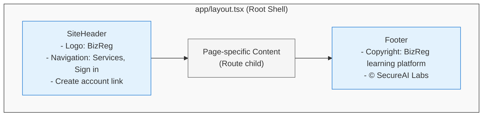
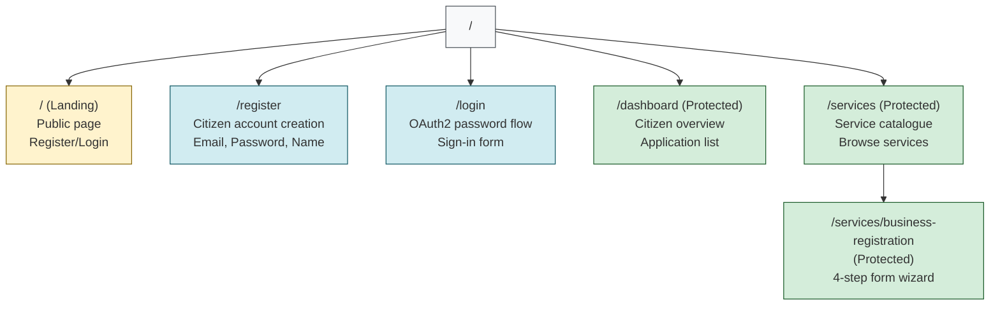

# Minimal frontend page layout

Every page uses the root `app/layout.tsx`, which provides the same lightweight shell:

## Current page structure

**Page Access Control**:
- 🟨 **Public**: Landing, Register, Login (no authentication required)
- 🟩 **Protected**: Dashboard, Services, Business Registration (require valid JWT token)
- 🔐 **Authorization**: `ProtectedRoute` component + FastAPI JWT dependencies enforce access
